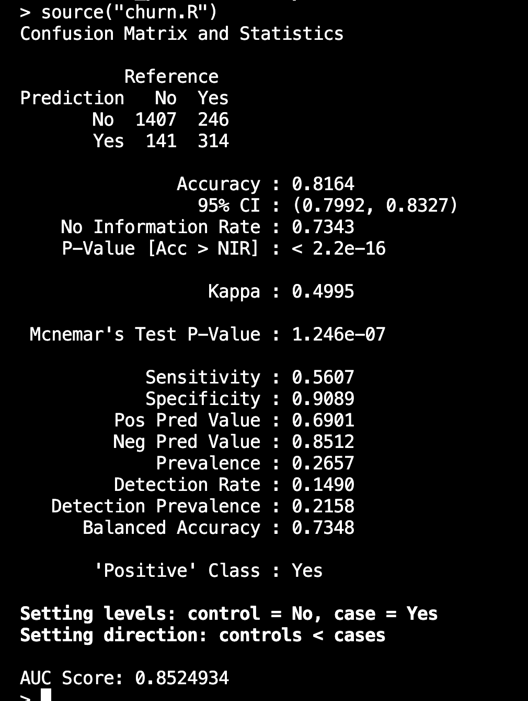
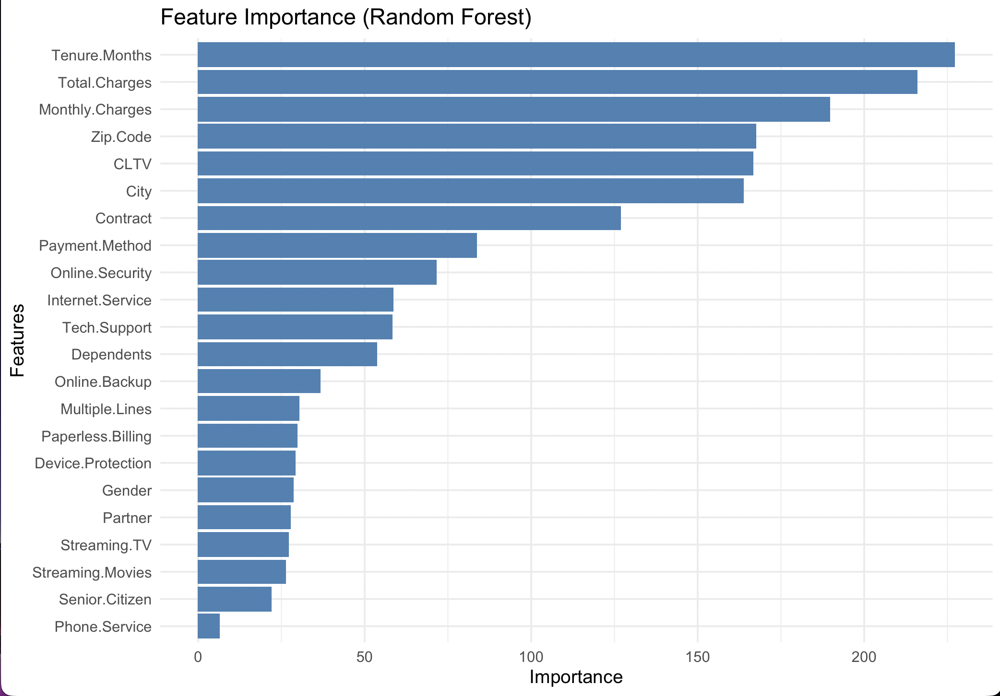

# Customer Churn Prediction Using Random Forest (R)

[]()
[]()
[]()
[]()

## Project Overview

This project implements a Random Forest classification model in R to predict customer churn using customer demographics, service usage and account information. The goal is to identify churn patterns and highlight the most influential features affecting customer retention.

## Technologies & Libraries

* R
* randomForest
* caret
* dplyr
* ggplot2
* pROC

## Dataset

* File: `customer_churn.csv`
* Target Variable: `Churn.Label`

## Methodology

1. Data loading and cleaning
2. Removal of leakage and irrelevant columns
3. Encoding categorical variables
4. Handling missing values
5. Train-test split (70% / 30%)
6. Random Forest model training
7. Model evaluation using confusion matrix and ROC
8. Feature importance visualization

## Model Evaluation Results

### Confusion Matrix



### Key Metrics

* Accuracy: 81.64%
* Balanced Accuracy: 73.48%
* Sensitivity (Recall - Churn): 56.07%
* Specificity: 90.89%
* Kappa Score: 0.4995
* AUC Score: 0.852

### Interpretation

* The model performs very well in identifying non-churn customers (high specificity).
* It shows moderate performance in detecting churn customers, which is common in imbalanced datasets.
* The AUC score of 0.85 indicates strong overall model performance.

## Feature Importance



### Insights

* Tenure Months is the most influential feature
* Followed by Total Charges and Monthly Charges
* These features strongly impact churn prediction

## Output

After executing the script, the following outputs are generated:

* Confusion matrix displayed in the terminal
* Accuracy, sensitivity, specificity and other evaluation metrics
* ROC curve visualizing model performance
* AUC score indicating classification quality
* Feature importance plot showing key influencing features

## How to Execute the Project

### Step 1: Open R

```bash
R
```

### Step 2: Restore project environment

```r
renv::restore()
```

### Step 3: Run the script

```r
source("churn.R")
```

### Expected Output

* Confusion matrix in terminal
* ROC curve plot
* AUC score
* Feature importance plot

## Future Enhancements

* Hyperparameter tuning
* Cross-validation
* Handling class imbalance (SMOTE)
* Comparison with other ML models
* Deployment using Shiny

## Author

Dhanvi Annam
Computer Science Student

## License

This project is intended for academic and learning purposes.
